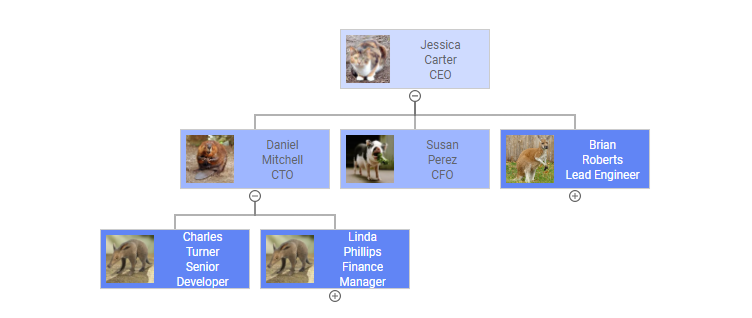
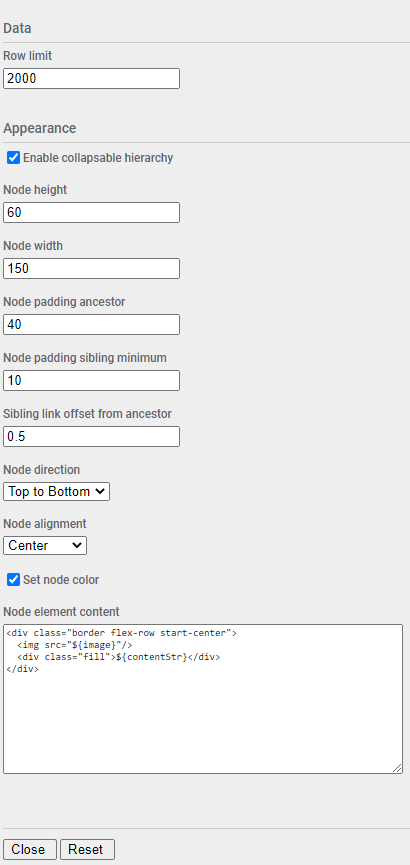
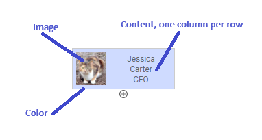
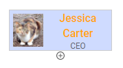
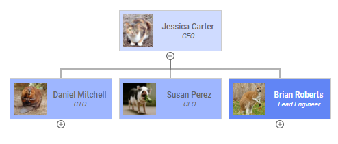
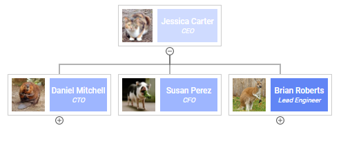
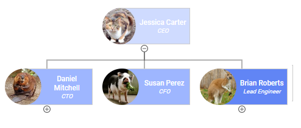
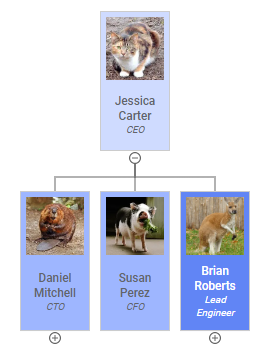
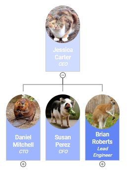

# Organization Chart Mod for Spotfire®

The Organization Chart Mod is used to visualize hierarchical structures using parent-child nodes. The classic use case for this is to display reporting lines in corporate organizational hierarchies, but it can be applied against any hierarchical dataset.



## Try this Mod in Spotfire® Analyst

### How to Open the Mod
1. Open Spotfire® Analyst, and create an analysis by loading some data.
1. Unzip the downloaded file, and locate the .mod file in the unzipped folder. 
1. Drag the file into the analysis. 
1. The visualization mod is added to the analysis.
1. To learn about the capabilities and limitations of this visualization mod, keep reading.

For general information on how to use and share visualization mods, [read the Spotfire documentation](https://docs.tibco.com/pub/sfire-analyst/latest/doc/html/en-US/TIB_sfire-analyst_UsersGuide/index.htm#t=modvis%2Fmodvis_how_to_use_a_visualization_mod.htm).

### Upgrading the Mod

Changes to axes and internal mod configuration may result in issues when upgrading this mod. For axis changes the mod should be recreated as a new visualization instance. For internal mod configuration changes use the **Reset** button in mod configuration of existing instances, and then reconfigure as necessary. See [Configuring the Organization Chart](#configuring-the-organization-chart) for more information. 

## Data Requirements

Every mod handles missing, corrupted and/or inconsistent data in different ways. It is advised to always review how the data is visualized.

This mod requires each data row to be identified by a unique identifier, and linked to parent nodes using the same unique identifer of the parent row.

## Setting up the Organization Chart

The Mod includes the following axes. Not all axis values are mandatory and this will be indicated.

### Trellis By

Optional. The Mod supports trellising with rows being grouped by the value in this axis. 

### Node ID

Mandatory. The unique identifier for each row passed into the mod.

### Parent Node ID

Mandatory for rows that have parents. The unique identifier for the parent node for each row passed into the mod.

### Content 

Mandatory. Content displayed within each node. This axis can contain multiple columns. See the section on [Node Content](#node-content) for more information how this data is processed.

### Image

Optional. Image data displayed in node content. This must be a text column containing image data encoded in Base64. This is required because the mods API does not support passing binary columns into a mod. The axis will accept multiple columns, but only the first will be processed; other columns will be ignored. See the section on [Node Content](#node-content) for more information about how images are displayed.

### Color 

Optional. Sets the node background color. See the section on [Node Content](#node-content) for other ways the color can be used.

## Configuring the Organization Chart

Additional configuration for the mod can be accessed by clicking on the small settings icon in the upper right corner of the visualization area. This will display the configuration properties over the visualization. Maximize the visualization if necessary to update the fields. The configuration panel will only be accessible when the analysis is in Editing mode. 

Click the **Close** button to apply the changes. Navigating to a different Spotfire® page will generally cause changes to be discarded. Click the **Reset** button to reset configuration back to mod defaults.



| Group | Property | Description | Remarks |
| ----- | -------- | ----------- | ------- |
| Data | Row limit | Maximum number of rows to render | If the row count is exceeded then an error message will be displayed. This is a safety feature to keep from accidentally rendering too much data. |
| Appearance | Enable collapsible hierarchy | Allow toggling display of child nodes |  |
| Appearance | Node height | Node height in pixels |  |
| Appearance | Node width | Node width in pixels |  |
| Appearance | Node padding ancestor | Padding between parent and child nodes in pixels |  |
| Appearance | Node padding sibling minimum | Padding between sibling nodes in pixels | Note that this is a minimum value and the tidy tree algorithm may expand the value between individual sibling pairs |
| Appearance | Sibling link offset from ancestor | Fractional offset for the sibling link from the ancestor node | This must be a value between 0.0 an 1.0. For vertical org charts, this represents the position of horizontal link line segments. For example, if **Node padding ancestor** is set to 100, and this value is set to 0.25, then the horizontal line will be 25px below the parent. |
| Appearance | Node direction | Progression direction from parent to child | Top to Bottom, Bottom to Top, Left to Right, Right to Left |
| Appearance | Node alignment | Parent node alignment | First Child, Center, Last Child |
| Appearance | Set node color | Enabled setting the background color of the node content | |
| Appearance | Node element content | HTML template for node content | See the section on [Node Content](#node-content) for more information |
| Tooltip | Show tooltips | Display tooltips | |
| Trellis | Trellis Direction | Direction for trellis panels | Columns or Rows |
| Trellis | Max Trellis Panel Count | Maximum number of trellis panels to render | If the panel count is exceeded then an error message will be displayed. This is a safety feature to keep from accidentally rendering too much data. |

## Node Content

This mod supports customization of the node display content. The content is composed using HTML and CSS so some knowledge of these technologies are required to be able to customize. 

By default, with no user configuration, a node will be composed as follows:



* Node size as specified in the mod configuration
* Image axis column displayed to the left. Image must be a text column in Base64 format. Multiple image columns are ignored, only the first is used.
* Content axis columns displayed to the right, one row per column, centered in remaining space
* Background color set to the color axis

If no image is specified, then the node will look like this:


The node content can be influenced with custom expressions in the column configuration. For example, if first name and last name are in separate columns, then a custom expression for the first Content column can be used to combine these into one. For example, using this expression:

```
Concatenate([First Name], " ", [Last Name])
```

would give the following node display:


Note the full name is now on a single line.

Because the node content is HTML and CSS, this can be embedded into custom expressions as well to influence how the data is displayed. For example, using this expression:

```
Concatenate("<b><font size='3' color='orange'>",[First Name]," ",[Last Name],"</font></b>")
```

would give the following node display:



This uses basic HTML tags to bold the name, change it to orange, and set the size to 3.

For more advanced control over the node content, the **Node element content** mod configuration can be customized. The default node configuration that renders the previous examples is this:

```
<div class="border flex-row start-center">
  
  <div class="fill">${contentStr}</div>
</div>
```

Bear in mind that the content must fit within the defined **Node height** and **Node width** settings. Any elements going outside this area will be clipped. 

There are a number of classes included here, which users can make use of to compose their own content.

| Class | Element | Remarks |
| -------- | ----------- | ------- |
| flex-row | div | Flexbox row layout, height and width 100% |
| flex-col | div | Flexbox column layout, height and width 100% |
| fill | div | Flexbox grow to fill space |
| start-center | div | Flexbox alignment for justify-content and align-items |
| center-center | div | Flexbox alignment for justify-content and align-items |
| end-center | div | Flexbox alignment for justify-content and align-items |
| start-start | div | Flexbox alignment for justify-content and align-items |
| center-start | div | Flexbox alignment for justify-content and align-items |
| end-start | div | Flexbox alignment for justify-content and align-items |
| start-end | div | Flexbox alignment for justify-content and align-items |
| center-end | div | Flexbox alignment for justify-content and align-items |
| end-end | div | Flexbox alignment for justify-content and align-items |
| border | div | 1px solid border color #CCCCCC with 5px padding |
| flex-row > img | img | Images inside flex-row are height 100% with 5% right padding |
| flex-col > img | img | Images inside flex-col are width 100% with 5% bottom padding |
| circle | img | Makes a circular image. The base image must be square for undistorted result. |

Beyond these sample classes, any custom styling can be applied using **style** attributes and standard CSS configuration.

Data can be accessed using JavaScript literal template notation. For example, to refer to the image data, use this expression:

```
${image}
```

The following template literals are available:

| Template | Data Axis | Remarks |
| -------- | ----------- | ------- |
| `${nodeId}` | Node ID | |
| `${parentNodeId}` | Parent Node ID | |
| `${contentStr}` | Content | Single string representation, with each column on a single line|
| `${contentObj}` | Content | Object representation, can refer to specific columns mapped into the axis by name: `${contentObj["First Name"]}`|
| `${contentArr}` | Content | Array representation, can refer to specific columns mapped into the axis by index: `${contentObj[0]}`|
| `${image}` | Image | Automatically prefixed with the value `data:image/png;base64,` which will convert Base64 data into a binary image|
| `${color}` | Color | |

The template engine replaces null or undefined expression evaluations with empty strings, so if your expected output isn't visible, this may be why. Also, if an expression results in an error, the template engine will return `ERROR` and the error details will be visible in the console.

Here are a few examples of customized node content.

```
<div class="border flex-row start-center">
  
  <div class="fill flex-col center-center">
	<div style="font-weight:bold;">${contentObj["First Name"]} ${contentObj["Last Name"]}</div>
	<div style="font-style:italic;font-size:10px">${contentObj["Job Title"]}</div>
  </div>
</div>
```



For the following example, **Set node color** configuration is set to false.

```
<div class="border flex-row start-center">
  
  <div class="fill flex-col center-center" style="color:white;background-color:${color}">
	<div style="font-weight:bold;">${contentObj["First Name"]} ${contentObj["Last Name"]}</div>
	<div style="font-style:italic;font-size:10px">${contentObj["Job Title"]}</div>
  </div>
</div>
```



For this example, **Set node color** configuration is set to false.
 
```
<div style="margin-left:33px;width:calc(100% - 33px);color:white;background-color:${color};" class="border flex-row start-center">
  
  <div class="fill flex-col center-center">
	<div style="font-weight:bold;">${contentObj["First Name"]} ${contentObj["Last Name"]}</div>
	<div style="font-style:italic;font-size:10px">${contentObj["Job Title"]}</div>
  </div>
</div>
```



These are all using flex-row layouts. But components can be displayed in a column as well using flex-col layouts.

For this example, **Node height** is set to 140 and **Node width** is set to 70.

```
<div class="border flex-col start-center">
  
  <div class="fill flex-col center-center">
	<div style="font-weight:bold;">${contentObj["First Name"]} ${contentObj["Last Name"]}</div>
	<div style="font-style:italic;font-size:10px">${contentObj["Job Title"]}</div>
  </div>
</div>
```



For this example, **Node height** is set to 140, **Node width** is set to 70, and **Set node color** is set to false.

```
<div style="margin-top:40px;height:calc(100% - 40px);color:white;background-color:${color};" class="border flex-col start-center">
  
  <div class="fill flex-col center-center">
    <div style="font-weight:bold;">${contentArr[0]} ${contentArr[1]}</div>
    <div style="font-style:italic;font-size:10px">${contentArr[2]}</div>
  </div>
</div>
```



## Using the Organization Chart

Once the mod is configured it will render a hierarchy of nodes. The mod will keep track of the node open/close state and positions for vertical and horizontal scroll bars so the view will re-render as last displayed when switching between pages.

### Marking
The mod supports marking of nodes if configured. Click a node to mark it. Use CTRL-Click to add additional rows to the marking, or remove an already marked row. To clear the marking, click in any open area. The mod also supports rectangular marking.

## Building the Project

In a terminal window:
- `npm install`
- `npm start`

In a new terminal window:
- `npm run server`

## More Information About Spotfire® Mods

- [Spotfire® Visualization Mods on the Spotfire® Community Exchange](https://community.spotfire.com/files/category/7-visualization-mods/): A safe and trusted place to discover ready-to-use Mods
- [Spotfire® Mods Developer Documentation](https://spotfiresoftware.github.io/spotfire-mods/docs/): Introduction and tutorials for Mods Developers
- [Mods by Spotfire®](https://github.com/spotfiresoftware/spotfire-mods/releases/latest): A public repository for example projects


## License

This project is licensed under the BSD license. The text can be found in the LICENSE file.

Copyright © 2024. Cloud Software Group, Inc. All Rights Reserved.


